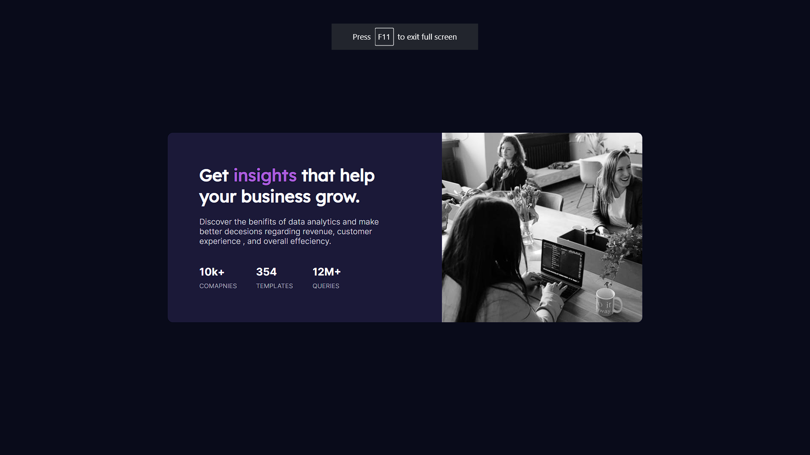

# Frontend Mentor - Stats Preview Card Component Solution
#### This is a solution to the [Stats preview card component challenge on Frontend Mentor](https://www.frontendmentor.io/chalcomponent-8JqbgoU62). Frondend Mentor challenges by building realstic projects.
## Table of contents 
- [Overview](#Overview)
- [The Challege ](#the-challenge)
- [Screenshot](#Screenshot)
- [My Process](#my-process)
- [Built with](#built-with)
- [What I Learned ](#what-i-learned)
- [Useful resources](#useful-resource)
- [Author](#Author)
- [Acknowledgments](#Acknowledgments)

### **Overview**
## The Challenge 
Users Should be able to : 
- View the optimal layout depending on their device's screen size
#Screenshot 

### Links 
Live Site Url : [Live site of the challenge hosted here](https://affectionate-fermat-6ccb2a.netlify.app/)

## My Process 
Hello 🙋🏼 this is third forntend mentor challenge and this challenge was simple but I did get confused on creating stats part, well as such i am a programmmer i figured out the issue and I Did it.

### Built with

- HTML 
- CSS 
I Does'nt Used any Framework as i mentioned this project is simple no need to use framework.

### What I Learned 
This Challenge Upgarded my CSS Skill as such i am practicing on improving CSS .

## Author 
- Website - Well I Haven't made my portfolio yet but gonna make it soon 
- Frontend Mentor - [@JuniorfoxDev](https://www.frontendmentor.io/profile/JuniorfoxDev)
- Instagram - [@i_vaibhavv08](https://www.instagram.com/i_vaibhavv08/?hl=en)
